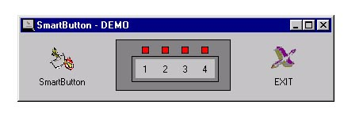



## A SmartButton Control

### Description

Simple flat button control, pops up on mouse over, Preeses down on mouse down, goes flat on mouse out, includes the MouseMove, MouseDown, MouseUp, MouseOut and Click Event, Can change the picture property or have no picture at all. No timer control needed.
 
### More Info
 

             |
---                |---
**Submitted On**   |2001-06-29 10:41:32
**By**             |[Jerrame Hertz](https://github.com/Planet-Source-Code/PSCIndex/blob/master/ByAuthor/jerrame-hertz.md)
**Level**          |Beginner
**User Rating**    |4.6 (51 globes from 11 users)
**Compatibility**  |VB 5\.0, VB 6\.0
**Category**       |[Custom Controls/ Forms/  Menus](https://github.com/Planet-Source-Code/PSCIndex/blob/master/ByCategory/custom-controls-forms-menus__1-4.md)
**World**          |[Visual Basic](https://github.com/Planet-Source-Code/PSCIndex/blob/master/ByWorld/visual-basic.md)
**Archive File**   |[A SmartBut218976292001\.zip](https://github.com/Planet-Source-Code/jerrame-hertz-a-smartbutton-control__1-24559/archive/master.zip)

